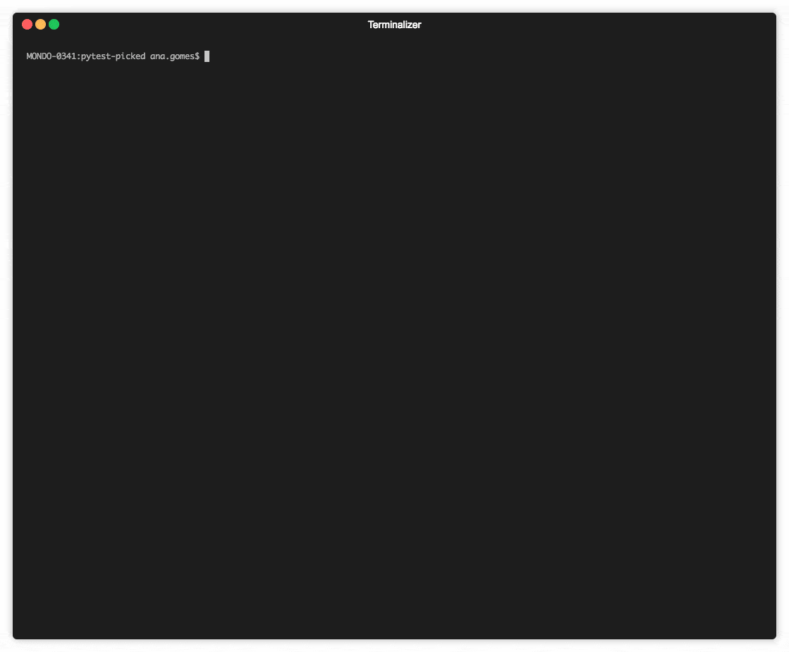

# pytest-picked

[](https://github.com/anapaulagomes/pytest-picked/actions?query=workflow%3ATests)

[](https://badge.fury.io/py/pytest-picked)

[](https://anaconda.org/conda-forge/pytest-picked)

[](https://pypi.org/project/pytest-picked)

Run the tests related to the unstaged files or the current branch
(according to Git)

---



Let's say you have the following output from `git status`:

    $ git status

    On branch main
    Your branch is ahead of 'origin/main' by 1 commit.
      (use "git push" to publish your local commits)

    Untracked files:
      (use "git add <file>..." to include in what will be committed)

      api.py
      tests/api/
      tests/test_board.py

    nothing added to commit but untracked files present (use "git add" to track)

Running `pytest --picked`, the plugin will run all tests that come from
this output.

    $ pytest --picked

    ============================= test session starts =============================
    platform darwin -- Python 3.6.4, pytest-3.6.0, py-1.5.3, pluggy-0.6.0
    rootdir: /Users/ana.gomes/personal-workspace/grandma, inifile:
    plugins: picked-0.1.0, mock-1.10.0, flask-0.10.0, deadfixtures-2.0.1
    collecting 34 items
    Changed test files... 1. ['tests/test_board.py']
    Changed test folders... 1. ['tests/api/']
    collected 34 items

    tests/test_board.py .                                                      [ 50%]
    tests/api/test_new.py .                                                    [100%]

    =========================== 2 passed in 0.07 seconds ===========================

All tests will be run from files and folders which are modified but not
yet committed. No more copy and paste!

## Usage

```bash
pytest --picked

pytest --picked=first

pytest --picked --mode=branch

pytest --picked --mode=unstaged  # default

pytest --picked --mode=branch --parent-branch=dev # if your parent branch differs from "main"
```

## Features

Using `git status`, this plugin allows you to:

- Run only tests from modified test files
- Run tests from modified test files first, followed by all unmodified tests

## Installation

You can install `pytest-picked` via [PyPI](https://pypi.org/project/pytest-picked/):

```bash
pip install pytest-picked
```

## Contributing

Contributions are very welcome. Tests can be run with
[tox](https://tox.readthedocs.io/en/latest/), so we can guarantee that it is working
in different python versions. Also, make sure to add tests and use `pre-commit`
before you submit a pull request.

## License

Distributed under the terms of the [MIT](http://opensource.org/licenses/MIT) license,
`pytest-picked` is free and open source software

## Issues

If you encounter any problems, please [file an issue](https://github.com/anapaulagomes/pytest-picked/issues)
along with a detailed description.
